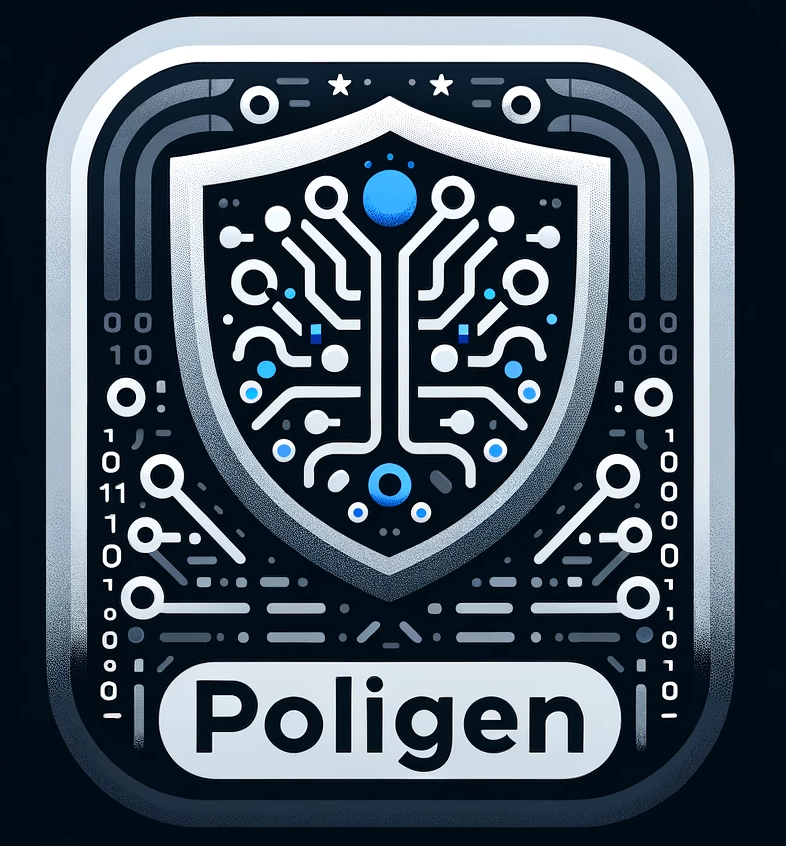

<div style="text-align:center"></div>

# PoliGen 📄🤖
## A Multi-Agent Chat Interface for Generating Cybersecurity Policies

PoliGen harnesses the power of multi-agent chat interfaces to streamline the generation of cybersecurity policies. Tailored for organisations seeking to update their policy documentation to align with recognised information security best practices, PoliGen simplifies the process, enabling both cybersecurity experts and non-experts to craft policies that meet their specific needs.

## Overview

Utilising an innovative combination of OpenAI's [GPT](https://openai.com/product#gpt) models and [AutoGen](https://microsoft.github.io/autogen/), a cutting-edge multi-agent conversation framework, PoliGen facilitates a dynamic, interactive environment where users can directly specify their cybersecurity policy requirements. This collaboration between human input and artificial intelligence enables policy documents to be produced within minutes instead of days.

## Features

* **Interactive Multi-Agent System:** Engage with a team of AI agents, including a User Proxy, Technical Writer, and Reviewer, each with specific roles to ensure the creation of comprehensive and professionally structured policy documents.
* **User-Guided Policy Generation:** Influence the policy generation process in real-time, providing feedback and direction to refine and tailor the output according to your organisational needs.
* **Best Practices Alignment:** Generated policies reflect the latest in cybersecurity best practices, ensuring your documentation is both current and effective.
* **Flexible and Accessible:** Designed for a wide range of users, from cybersecurity professionals to those with limited technical expertise, making policy generation accessible to all.

## Installation

1. Clone the PoliGen repository to your local machine.

    ```bash
    git clone https://github.com/mrwadams/poligen.git
    ```
    
2. Change into the PoliGen directory.

    ```bash
    cd poligen
    ```

3. Install the required dependencies.
    
    ```bash
    pip install -r requirements.txt
    ```

4. Start the application.

    ```bash
    chainlit run app.py
    ``````

5. If you don't already have one stored, you will be prompted to enter your OpenAI API key.

## Live Demo
You can also try out PoliGen in your browser using the HuggingFace Spaces platform. Click the button below to launch the live demo.

[](https://huggingface.co/spaces/mrwadams/poligen)

## Contributions

PoliGen is an open-source project and contributions are welcome. If you're interested in improving the tool or adding new features, please fork the repository and submit a pull request with your changes.

## Acknowledgements
This project was inspired by Antoine Ross' AutoGen Article Generator, which can be found [here](https://github.com/antoineross/autogen-article-generator/tree/main).

## License
PoliGen is released under MIT License, allowing for wide-ranging flexibility in both personal and commercial use.